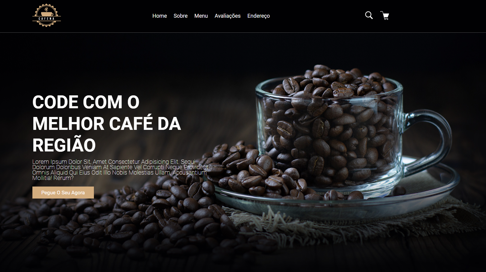

<h1 align="center"> Coffe Page </h1>

Roberto Santos  
Desenvolvedor Web</h3>

  <a href="#-tecnologias">Tecnologias</a>&nbsp;&nbsp;&nbsp;|&nbsp;&nbsp;&nbsp;
  <a href="#-projeto">Projeto</a>&nbsp;&nbsp;&nbsp;

 

  

## 🚀 Tecnologias

Esse projeto foi desenvolvido com as seguintes tecnologias:

✅ Uso semântico do HTML
✅ CSS
✅ Git

 

## 💻 Projeto

Esse projeto foi desenvolvido para exercitar meus conhecimentos em HTML & CSS.

 

---

by betox.santos

